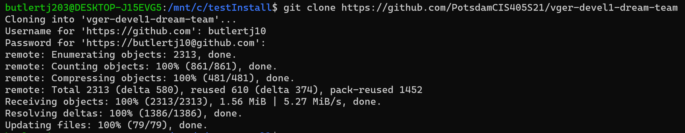

# VGER: Virtual Guide for Educational Readiness

  

VGER is a web application written in django framework with a mariadb backend. The purpose of VGER is to survey

college students about their covid-19 experience and its relations to their eduction.

  

## Dependencies

The only dependecy required before running is docker which will subsequently build the images required for running

* Docker

    * Django

    * Mariadb

---

### For first time users; detailed documentation on how to install the product and how to generally navigate the website is provided in the documentation folder. Please make sure to check that out!

### ``runInitial.py`` usage
> Initial Install Script: initializes/installs the database, in order to start running the product

```shell
command: 

python3 run.py runInitial.py

```

---

### ``runVger.py`` usage
> NOTE: it is REQUIRED that the initialization script has been run before the start script

> Run System Start Script: starts the system. 

> To spin the system back down make sure you either run 'docker-compose down' or you run 'closeVger.py'

```shell
command: 

python3 run.py runVger.py

```

---

### ``runTests.py`` usage
> NOTE: it is REQUIRED that the initialization script has been run before the tests script

> Run Tests Script: runs all test files in project apps for all Operating Systems

```shell
command: 

python3 run.py runTests.py

```

---

### ``closeVger.py`` usage
> spins the system down, preferably used after 'runVger.py'

```shell
command: 

python3 run.py closeVger.py

```

## Usage

  
  
### How to spin up the server

```shell

python3 run.py build

python3 run.py up

```

open your browser and go to localhost:8000

  

---

### ``run.py`` usage

this is to help navigate project functionality.

  **migrate**   
> makes migrations and applies them

```shell
command: 

python3 run.py migrate

```
  
**up [-d]**   
> spins up the djangosite [runs quietly]

```shell
command: 

python3 run.py up -d

```
**down** 
> brings the docker container down

```shell
command: 

python3 run.py down

```

**build** 
> builds docker-compose images

```shell
command: 

python3 run.py build

```

**admin ** 
> creates a new superuser

```shell
command: 

python3 run.py admin

```

**inspectdb** 
> inspects the django database setups

```shell
command: 

python3 run.py inspectdb

```

**own** 
> changes current user to new owner of all subdirectors

```shell
command: 

python3 run.py own

```

**startapp 'name'** 
> creates a new app subdirectory with given name (required)

```shell
command: 

python3 run.py startapp 'name'

```

**test** 
> runs all test files in project apps, optional app name to test specific app

```shell
command: 

python3 run.py tests

```

---

## Installing the Website

    1. Open your terminal
   
    2. Navigate to your desired directory to install this website
   
    3. Now, in your terminal, enter: git clone https://github.com/PotsdamCIS405S21/vger-devel1-dream-team
      - You will need to enter your GitHub account to complete the cloning process
  


    4. Navigate into the newly created 'vger-devel1-dream-team' directory
   
    5. Now, in your terminal, enter: python3 ./runInitial.py
      - You will be prompted to enter your sudo password 
      - You will later to be prompted to create a user
          - Enter a username and password (do not forget these)
  


    6. Your website is now up and runnin
   
    7. To terminate do one of the following:
        
        Recommended Method: 
          - Open another terminal and navgiate to the 'vger-devel1-dream-team' directory
          - Once there, in your terminal, enter: python3 ./CloseVger.py

        Other Method:
          - Press crtl + C

    8. In the original terminal you will receive a message notifying you that the website is now offine
   
    9.  To bring it back up, in your terminal, enter: python3 ./runVger.py 
      - Open the browser of your choice and in the URL search bar enter: http://localhost:8000/
      - This will bring you to the website's homepage
