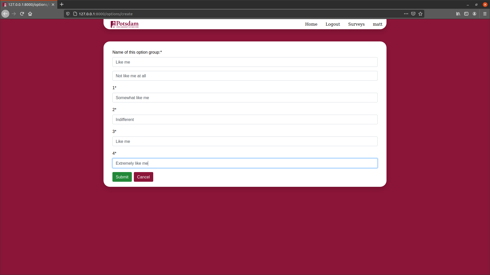

# General Use Guide - Admin
General usage guide for the VGER online readiness system dream team. Within this guide you will find several objects to create such as:
- Surveys: a collection of categories and questions for students and faculty to fill out.
- Categories: a subset of survey, these are as the name suggests, a category or grouping of like questions.
- Questions: the actual questions that will make up a specific survey.
- Option Group, also called "range" is a grouping of choices(option_choices) that students can select for an answer. There are three main option groups as of 5/17/2021: True/False, Text, and Range(multiple choice). Ranges can be customized using the "view ranges" button from the "Surveys" page. Here you can name the range and set the title of the weights in order from 0-4.

### Starting from Scratch

### Option Groups and Choices:
These allow us to create a custom question format. Since you as an admin are creating the survey it is designed such that you will know the format of your questions. We have placed these options at the bottom of the Survey List page. Before creating a survey it is recommended to follow the button prompt for "Vew Ranges" and create the choices(ranges) for the different questions you will be asking students.

### Survey Creation:
To create a survey as an admin simply:
- go to the survey page and use the new survey button.

- this will take you to a form with which you can fill out the name, description, and version, start, and end date of the survey.

From this point you'll be taken to a list of categories, here you will need to create a category.
### Category Creation:
On the survey detail page you will find a cascading menu that will list all categories in that survey. To create a category from here:
- navigate to a survey and from the detail page you'll be given a list of categories(this may be blank don't panic.)

- on this page you will then notice at the bottom the ability to create a category via a button labeled as such.
- clicking on this button will take you to a form page that will allow you to create a category with its respective details.

- upon submission of this form you will be taken to the details page for the category you just created. This brings us to question creation:

### Question Creation:
On the survey detail page you will find a cascading menu that will list all categories in that survey. To create a new question from here:
- click on the button 'create question' 
- from this point you'll be taken to a form with the appropriate information
  - Within this form you will be able to select the option group and the response type.

### Updating and Deleting:
Each of the five fields above has its own button leading to either a form(update) or prompt(delete). These respective options handle the bullwork of their assigned tasks.

