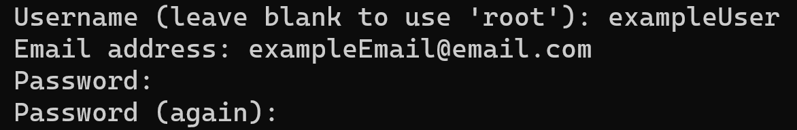

## Installing the Website

    1. Open your terminal
   
    2. Navigate to your desired directory to install this website
   
    3. Now, in your terminal, enter: git clone https://github.com/PotsdamCIS405S21/vger-devel1-dream-team
      - You will need to enter your GitHub account to complete the cloning process
  

    4. Navigate into the newly created 'vger-devel1-dream-team' directory
   
    5. Now, in your terminal, enter: python3 ./runInitial.py
      - You will be prompted to enter your sudo password 
      - You will later to be prompted to create a user
          - Enter a username and password (do not forget these)
  

    6. Your website is now up and runnin
   
    7. To terminate do one of the following:
        
        Recommended Method: 
          - Open another terminal and navgiate to the 'vger-devel1-dream-team' directory
          - Once there, in your terminal, enter: python3 ./CloseVger.py

        Other Method:
          - Press crtl + C

    8. In the original terminal you will receive a message notifying you that the website is now offine
   
    9.  To bring it back up, in your terminal, enter: python3 ./runVger.py 
      - Open the browser of your choice and in the URL search bar enter: http://localhost:8000/
      - This will bring you to the website's homepage
